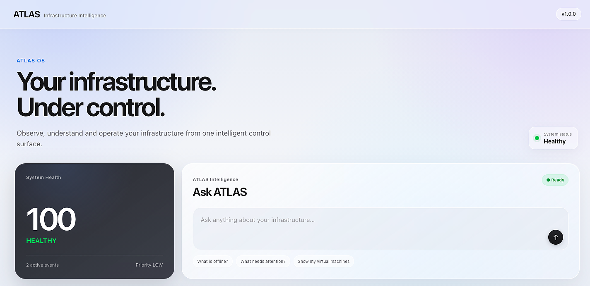
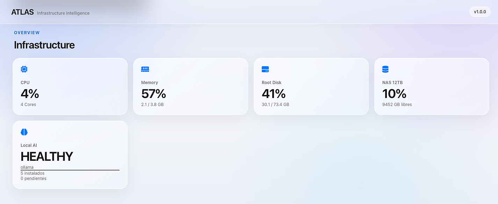
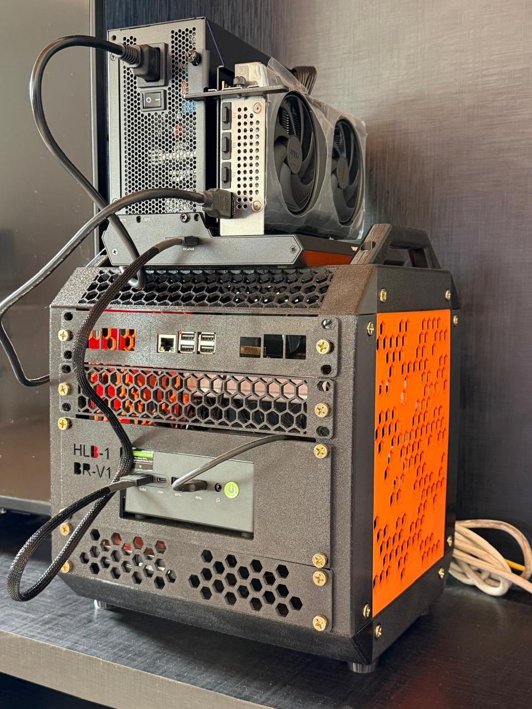
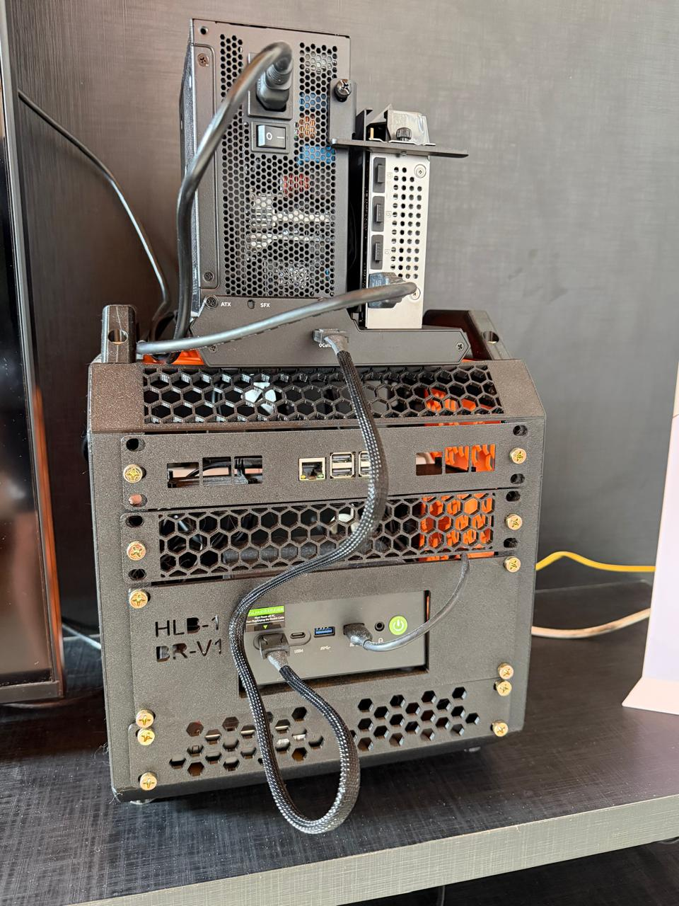
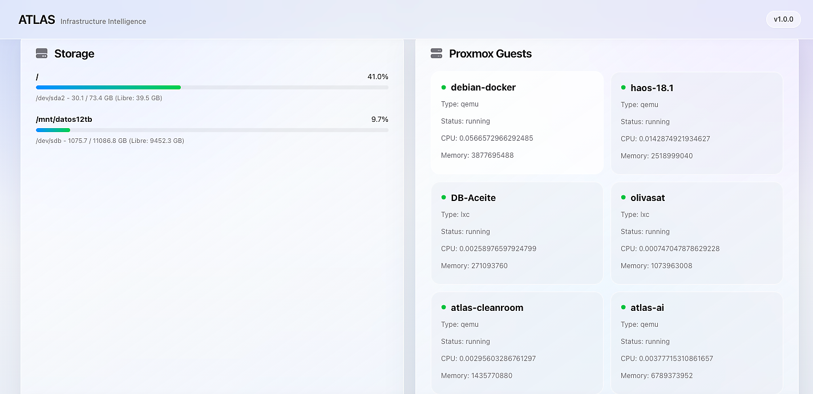

# ATLAS OS

<p align="center">
  <strong>Infrastructure Intelligence & Governed Operations for Self-Hosted Systems</strong>
</p>

<p align="center">
  Observe. Understand. Investigate. Operate safely.
</p>

<p align="center">
  
</p>

---

## What is ATLAS OS?

ATLAS OS is a self-hosted infrastructure intelligence and governed-operations platform designed for homelabs and private infrastructure.

It discovers infrastructure, builds an Asset Registry and topology, collects operational evidence, correlates events and incidents, supports AI-assisted investigation, and exposes a controlled Operator for explicitly governed infrastructure actions.

ATLAS is deliberately designed so that infrastructure authority does not belong to the language model. The LLM can investigate and propose, while ATLAS policy, persisted state, approvals, execution handlers and independent verification remain authoritative.

## ATLAS v1.0

Current stable release: `v1.0.0`

ATLAS v1.0 focuses on four responsibilities:

- **Infrastructure knowledge** — discover and maintain trustworthy infrastructure state.
- **Operational intelligence** — transform observations into events, incidents and context.
- **Local AI investigation** — investigate infrastructure without making the LLM authoritative.
- **Governed operations** — execute only explicit, policy-controlled and independently verified actions.

## Infrastructure overview

<p align="center">
  
</p>

The v1.0 core includes Asset Registry, stable identities, capabilities, criticality, topology, snapshots, health evaluation, events, persistent incidents, Docker and Proxmox discovery, local system/storage state, optional Prometheus enrichment and local AI provider state.

## Real infrastructure

ATLAS OS is developed and validated against a real self-hosted environment, not only synthetic fixtures.

<p align="center">
  
  &nbsp;
  
</p>

The environment combines virtualization, containers, storage, local AI and physical infrastructure under a single operational knowledge layer.

## Proxmox integration

<p align="center">
  
</p>

ATLAS treats external providers as evidence sources, not as infallible truth. Provider degradation is recorded explicitly instead of being interpreted as an authoritative empty inventory.

## Architecture

```text
Infrastructure
    |
    v
Providers / Discovery
    |
    +--> Asset Registry
    |       |
    |       +--> Knowledge / Graph
    |
    +--> Snapshots / Health
            |
            +--> Events
                    |
                    +--> Incidents / NOC
                            |
                            +--> Investigation
                            |
                            +--> SafeAction
                                    |
                                    +--> Policy
                                            |
                                            +--> Human Approval
                                                    |
                                                    +--> Execution Claim
                                                            |
                                                            +--> Executor
                                                                    |
                                                                    +--> Verification
```

The AI layer does not own infrastructure authority.

## Governed Operator

ATLAS does not expose unrestricted shell execution to the AI layer.

Supported v1.0 actions:

- Docker containers: start, stop, restart
- systemd services: start, stop, restart
- Proxmox QEMU VMs: start, stop, restart
- Proxmox LXC containers: restart

Execution support does not imply policy permission. Asset presence, capabilities, criticality, importance, handler allowlists and policy remain independent safety gates.

## Safety model

ATLAS v1.0 intentionally does **not** provide:

- unrestricted autonomous execution;
- arbitrary shell mutation;
- direct LLM infrastructure mutation;
- automatic destructive rollback;
- automatic retry of uncertain actions;
- bypass of protected HIGH or CRITICAL assets;
- mutation based on incomplete discovery.

A successful remote command is not considered proof of infrastructure success. ATLAS independently verifies the resulting state. An uncertain result becomes a recovery problem, not an automatic retry.

## Provider failure semantics

```text
Docker unavailable:
docker.available = false
health = warning

Proxmox unavailable:
proxmox.available = false
health = warning

Incomplete discovery:
DiscoveryResult.complete = false

AI provider unavailable:
status = OFFLINE
provider_available = false
```

An unavailable provider is not treated as an authoritative empty inventory. Incomplete discovery causes authoritative reconciliation and mutating NOC processing to be skipped.

## Runtime

Main production services:

```text
atlas-web.service
atlas-collector.service
```

Persistent operational state is stored in SQLite using WAL mode.

## Release qualification

The v1.0 release line has been validated with:

- **792 automated tests**;
- SQLite `integrity_check` and `quick_check`;
- consistent online database backup;
- controlled service restart and real VM reboot;
- automatic service and Docker workload recovery;
- storage remount and runtime secret restoration;
- Proxmox and Operator API recovery;
- Docker and Proxmox provider failure isolation;
- simultaneous external-provider degradation;
- local-host fail-closed behavior;
- incomplete-discovery mutation guard;
- AI provider OFFLINE behavior;
- snapshot schema v3 degradation evidence.

## Design principles

**Infrastructure truth before AI opinion.**

**Investigation is separate from authority.**

**Actions are explicit, governed and auditable.**

**Execution must be independently verified.**

**Missing evidence must not silently become false certainty.**

**External provider failure must not erase known infrastructure.**

## Documentation

- [`RELEASE_CONTRACT_V1.md`](docs/RELEASE_CONTRACT_V1.md)
- [`BACKUP_RESTORE_V1.md`](docs/BACKUP_RESTORE_V1.md)
- [`BOOT_RECOVERY_V1.md`](docs/BOOT_RECOVERY_V1.md)
- [`OPERATOR_SINGLE_EXECUTION.md`](docs/OPERATOR_SINGLE_EXECUTION.md)

## Development validation

```bash
export PYTHONPATH="$PWD/src"
/opt/atlas/.venv/bin/python -m pytest -q
```

A release is accepted only with a clean full suite.

## Versioning

Package metadata: `1.0.0`

Git release tag: `v1.0.0`

## Beyond v1.0

```text
ATLAS
├── Infrastructure
├── Intelligence
├── Operator
│
├── ATLAS Home
├── ATLAS Science
└── ATLAS Sky
```

Home Assistant integration, ATLAS Science, Atlas Sky, broader infrastructure capabilities and domain-specific systems belong after the v1.0 stability boundary.

## License

ATLAS OS is licensed under the Apache License 2.0.
